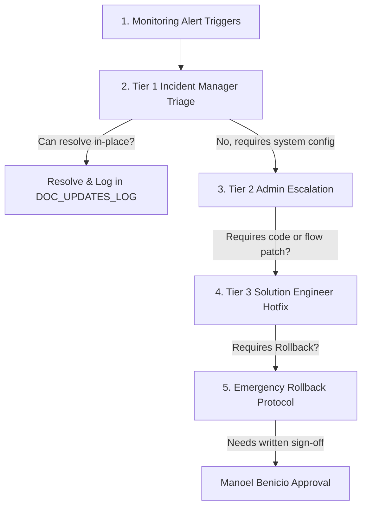

# PMO Intelligent Hub — Monitoring Escalation Matrix v3.16

Last updated: 2026-05-22 20:20:00 BRT | Gemini sub-1 | Escalation Matrix Drafted

---

This matrix details the escalation pathways, roles, and contacts for supporting the **PMO Intelligent Hub Release 3.16** in production.

## 1. Operational Support Contacts

| Role | Support Tier | Primary Contact UPN | Emergency Contact | Response SLA |
|---|---|---|---|---|
| **Incident Manager** | Tier 1 (T1) | `t1-pmo@stt.com` | Teams Channel: Support | 15 minutes |
| **System Administrator** | Tier 2 (T2) | `m365-admin@stt.com` | SMS/Teams: Admin Emergency | 1 hour |
| **Card Integration Specialist** | Tier 2 (T2) | `gemini-sub1@stt.com` | Teams Direct Message | 1 hour |
| **Documentation & Compliance** | Tier 2 (T2) | `gemini-sub2@stt.com` | Teams Direct Message | 2 hours |
| **Lead Solution Engineer** | Tier 3 (T3) | `codex-lead@stt.com` | Phone: +55 (11) 99999-0000 | 2 hours |
| **Business Owner / Approver** | Tier 3 (T3) | `owner-manoel@stt.com` | Direct Board Escalation | 4 hours |

---

## 2. Escalation Workflow

### 2.1. Escalation Process Guidelines

1. **Triggering Incident**: An alert is generated via Power Automate Native Run Alerts or direct report in Teams (e.g. Adaptive Card fails to render, or list write returns `FlowActionBadGateway`).
2. **Initial Assessment (T1)**: The Incident Manager checks the flow ID and run logs. If the error is transient (e.g. temporary network lag, user missing a required field), T1 guides the user or retries the flow.
3. **Admin Escalation (T2)**: If the issue persists or points to a SharePoint schema drift or Entra permissions, the ticket escalates to Tier 2.
4. **Code Patching (T3)**: If there is an underlying issue in the card payload size (>27KB) or dynamic bindings, Tier 3 Solution Engineers are dispatched.
5. **Emergency Decision**: If the issue blocks operations for more than 4 hours, T3 requests written approval from Manoel Benicio in the active thread to execute the Rollback Command to Release 3.10.
