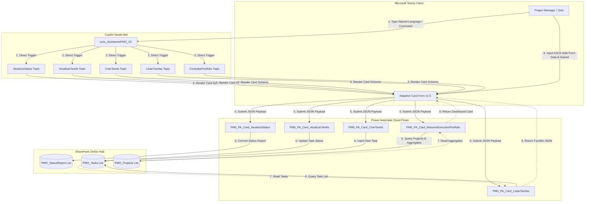

# PMO Intelligent Hub — M2 Hybrid Card-First Architecture Diagram

Last updated: 2026-05-22 20:15:00 BRT | Gemini Lead | Architectural Diagram

---

This diagram shows the transactional and reporting integration flows of the PMO Intelligent Hub v2.0 (Milestone 2).

### Flow Descriptions
1. **Trigger Phase**: The user interacts with `pmo_AssistentePMO_V2` in Teams via text (e.g., "Atualizar Status").
2. **Card Rendering Phase**: Instead of initiating a multi-step conversation, the Bot returns an ASCII-safe Microsoft Adaptive Card v1.5 with input forms.
3. **Form Submission**: The user fills out the form in the card and clicks the submit button. This passes structured JSON directly to the Power Automate cloud flow.
4. **Data Commitment**: The cloud flow validates inputs, maps parameters, and writes/queries the SharePoint Online list using standard connectors.
5. **Close Loop**: The flow returns verification or dynamic data, rendering a refreshed confirmation view on the Adaptive Card.
