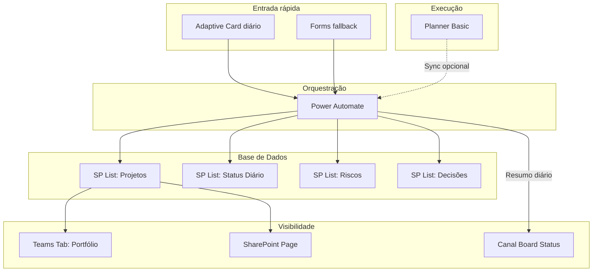

# Arquitetura PMO/Projetos — Microsoft 365

## 1. Executive Summary

### Recomendação Principal

A melhor arquitetura para gestão automatizada de projetos com baixa fricção e alta visibilidade executiva é a **Solução D — SharePoint Project Status Hub + Planner Operacional**, evoluída com Copilot Studio na Fase 2.

**Por que esta é a melhor:**
- SharePoint Lists como **fonte única da verdade** para status executivo
- Planner Basic como camada de **execução/tarefas** (sem duplicar status)
- Teams como **front-end único** (tabs, cards, canais estruturados)
- Power Automate como **orquestração** (standard connectors, sem premium)
- Adaptive Cards como **mecanismo primário de entrada e saída**
- Copilot Studio como **evolução natural** na Fase 2 (não dependência)
- **Zero dependência** de Power BI, Dataverse, Planner Premium ou licenças adicionais no MVP

**Resultado esperado:** Um gerente atualiza o status de um projeto em **menos de 20 segundos** via Adaptive Card no Teams. O board vê o portfólio consolidado **em tempo real** via tab SharePoint no Teams, sem pedir planilha a ninguém.

---

## 2. Top 5 Soluções Avaliadas

---

### Solução A — SharePoint Lists + Teams Tabs + Power Automate + Adaptive Cards

**Descrição:** SharePoint Lists como base oficial. Teams como front-end. Power Automate envia cards diários e atualiza listas. Planner é opcional/ausente.

**Componentes Microsoft:** SharePoint Lists, Teams, Power Automate, Adaptive Cards

**Fluxo do Usuário:**
1. Recebe Adaptive Card no Teams às 9h
2. Preenche: Status RAG (dropdown), Resumo (texto curto), Risco, Próxima ação
3. Clica "Enviar" → Power Automate grava no SharePoint
4. Board abre tab do SharePoint no Teams → vê portfólio consolidado

| Aspecto | Avaliação |
|---|---|
| **Prós** | Simples, zero licença adicional, familiar, rápido de implementar |
| **Contras** | Sem camada de tarefas/execução, sem inteligência conversacional |
| **Custo** | Zero incremental (M365 standard) |
| **Complexidade** | Baixa (3-5 fluxos PA) |
| **Licenças** | M365 E3/E5 standard. PA standard connectors. |
| **Esforço** | 2-3 semanas |
| **Quando usar** | MVP rápido sem necessidade de Planner |
| **Nota** | **7.5/10** |

---

### Solução B — Copilot Studio PMO Agent + SharePoint Lists + Power Automate + Teams

**Descrição:** Agente PMO no Copilot Studio recebe mensagens em linguagem natural, interpreta intenção, atualiza SharePoint Lists, e publica resumos no Teams.

**Componentes Microsoft:** Copilot Studio, SharePoint Lists, Power Automate, Teams

**Fluxo do Usuário:**
1. Digita no chat: "Atualiza projeto Mobile para amarelo. Risco é atraso na loja."
2. Agente confirma: "Vou atualizar Mobile → Amarelo. Risco: atraso na loja. Confirma?"
3. Usuário: "Sim"
4. Agente grava e responde: "Atualizado! ✅"

| Aspecto | Avaliação |
|---|---|
| **Prós** | UX incrível, linguagem natural, reduz fricção ao mínimo |
| **Contras** | Requer Copilot licensing, risco de interpretação errada |
| **Licenças** | **M365 Copilot ($30/user/mês)** ou Copilot Studio standalone + Credits |
| **Complexidade** | Média-alta |
| **Esforço** | 3-5 semanas (após MVP pronto) |
| **Quando usar** | Fase 2, quando SharePoint Lists estiverem maduros |
| **Nota** | **8.0/10** (mas não para MVP) |

---

### Solução C — Planner Padrão como Camada Principal + Teams + Power Automate

**Descrição:** Cada projeto/área tem um Planner Basic. Buckets = fases/status. Labels = RAG. Teams exibe Planner como aba.

**Componentes Microsoft:** Planner Basic, Teams, Power Automate, SharePoint (consolidação)

| Aspecto | Avaliação |
|---|---|
| **Prós** | Visual kanban familiar, drag-and-drop, nativo no Teams |
| **Contras** | Planner NÃO é fonte da verdade para status executivo; fragmentação; sem histórico de status |
| **Riscos** | 1 plano por projeto = N planos fragmentados, consolidação manual |
| **Licenças** | M365 standard |
| **Esforço** | 4-6 semanas (consolidação é gargalo) |
| **Quando usar** | Equipes <5 projetos que já usam Planner |
| **Nota** | **5.5/10** |

---

### Solução D — SharePoint Project Status Hub + Planner Operacional ⭐ RECOMENDADA

**Descrição:** SharePoint Lists são a fonte oficial do status executivo. Planner Basic apenas para execução/tarefas. Teams é a interface. Power Automate orquestra tudo.

**Dados no SharePoint vs Planner:**

| Dado | Onde | Por quê |
|---|---|---|
| Status RAG, resumo, riscos, decisões | SharePoint | Dado executivo, histórico, auditável |
| Tarefas, sprints, assignments | Planner | Kanban visual, operacional |

| Aspecto | Avaliação |
|---|---|
| **Prós** | Separação clara, governança forte, escalável, zero licença extra, histórico completo |
| **Contras** | Setup inicial mais robusto (4 listas, 8-10 fluxos) |
| **Custo** | Zero incremental |
| **Escalabilidade** | Excelente (indexar colunas, views filtradas, archiving) |
| **Licenças** | M365 E3/E5 standard. Todos connectors standard. |
| **Esforço** | 3-4 semanas para MVP |
| **Nota** | **9.0/10** |

---

### Solução E — Teams-native PMO Cockpit

**Descrição:** Experiência imersiva no Teams com canais temáticos, tabs, cards diários e de exceção.

**Canais sugeridos:**

| Canal | Propósito | Frequência |
|---|---|---|
| 📊 Board Status | Resumo diário consolidado | Diário 17h |
| 🔴 Projetos Críticos | Alertas vermelhos | Event-driven |
| ⚠️ Riscos e Bloqueios | Novos riscos | Event-driven |
| 📋 Decisões Pendentes | Cards de aprovação | Event-driven |

| Aspecto | Avaliação |
|---|---|
| **Prós** | Tudo em um lugar, experiência imersiva |
| **Contras** | Risco de notification fatigue |
| **Nota** | **7.0/10** standalone / **9.5/10** combinada com D |

---

## 3. Soluções Adicionais Pesquisadas

| Solução | Descrição | Nota | Recomendação |
|---|---|:---:|---|
| **F — Microsoft Forms** | Formulário rápido como entrada alternativa | 6.0 | Fallback Fase 1 |
| **G — Loop Components** | Tabelas live em chats/canais | 5.0 | Complemento para reuniões |
| **H — Power Apps Canvas** | App customizada no Teams | 6.5 | Fase 4 se cards insuficientes |
| **I — SharePoint Pages** | Dashboard com web parts de lista | 7.0 | Complemento à Solução D na Fase 1 |
| **J — Azure DevOps Integration** | Sync sprints → status executivo | 6.0 | Fase 4 para squads de software |

---

## 4. Matriz de Decisão

### Escala: 1 (ruim) a 5 (excelente)

| Critério (Peso) | A (SP+Cards) | B (Copilot) | C (Planner) | D (Hub) ⭐ | E (Cockpit) |
|---|:---:|:---:|:---:|:---:|:---:|
| Facilidade usuário (25%) | 4 | 5 | 3 | 4 | 4 |
| Baixo custo (20%) | 5 | 3 | 5 | 5 | 5 |
| Visibilidade executiva (20%) | 4 | 4 | 2 | 5 | 4 |
| Baixa manutenção (15%) | 4 | 3 | 3 | 4 | 3 |
| Integração Microsoft (10%) | 4 | 5 | 4 | 5 | 5 |
| Escalabilidade (10%) | 4 | 4 | 2 | 5 | 3 |
| **Nota Ponderada** | **4.15** | **3.95** | **3.10** | **4.60** | **3.95** |

### Ranking Final

| # | Solução | Nota | Recomendação |
|:---:|---|:---:|---|
| 🥇 | **D — SharePoint Hub + Planner** | **4.60** | MVP — implementar primeiro |
| 🥈 | A — SP + Cards simplificado | 4.15 | Alternativa sem Planner |
| 🥉 | B — Copilot Studio | 3.95 | Fase 2 |
| 4 | E — Teams Cockpit | 3.95 | Combinar com D |
| 5 | C — Planner como base | 3.10 | Não recomendada |

---

## 5. Recomendação Final

### O que construir primeiro (MVP — Semanas 1-4):
1. 4 SharePoint Lists (Projetos, Status Diário, Riscos, Decisões)
2. Equipe PMO no Teams com canais estruturados
3. Tabs com SharePoint Lists no Teams
4. 3 Adaptive Cards (check-in, projeto crítico, decisão)
5. 5 fluxos Power Automate essenciais
6. SharePoint Page como dashboard

### O que evitar:
- ❌ Power BI como dependência
- ❌ Copilot Studio no MVP
- ❌ Power Apps no MVP
- ❌ Planner Premium / Dataverse
- ❌ Código customizado

### Como medir sucesso:
1. % projetos atualizados diariamente (meta: >80%)
2. Tempo médio de atualização (meta: <30s)
3. Redução de pedidos de planilha pelo board (meta: zero)
4. % projetos vermelhos escalados automaticamente (meta: 100%)

### Próximos 10 Passos Concretos

| # | Ação | Prazo |
|---|---|---|
| 1 | Aprovar arquitetura D + E | Semana 0 |
| 2 | Criar site SharePoint "PMO Hub" com 4 listas | Semana 1 |
| 3 | Criar Equipe "PMO" no Teams com canais | Semana 1 |
| 4 | Adicionar tabs de SharePoint Lists no Teams | Semana 1 |
| 5 | Desenvolver 3 Adaptive Cards (JSON) | Semana 2 |
| 6 | Criar 5 fluxos Power Automate essenciais | Semana 2-3 |
| 7 | Criar SharePoint Page dashboard | Semana 3 |
| 8 | Carregar 5-10 projetos piloto | Semana 3 |
| 9 | Rodar piloto com 5 PMs por 1 semana | Semana 4 |
| 10 | Coletar feedback e planejar Fase 2 | Semana 5 |
