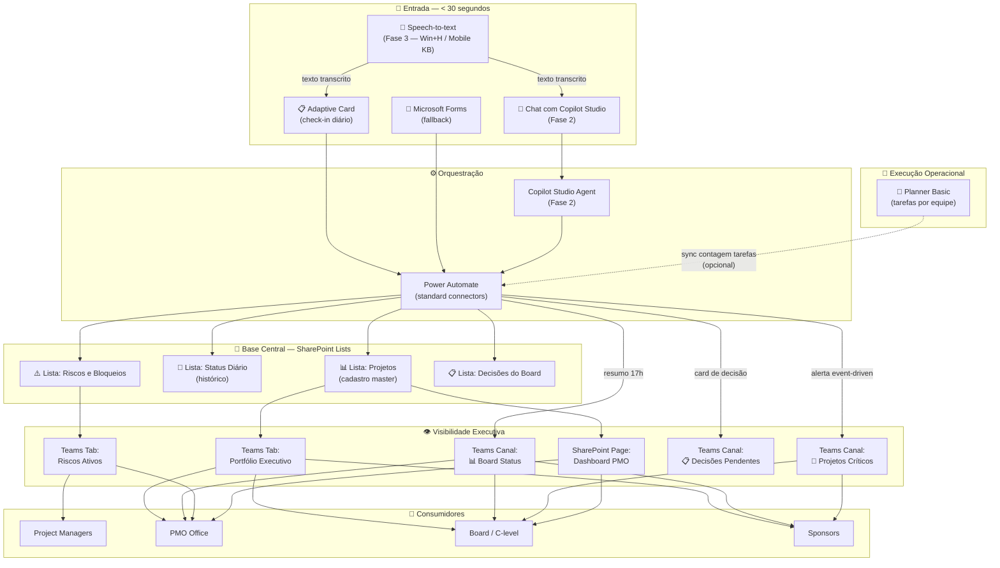

# Arquitetura, Modelo de Dados e Estratégia sem Power BI

## 1. Arquitetura Recomendada Completa

---

## 2. Modelo de Dados — SharePoint Lists

### 2.1 Lista: Projetos (Cadastro Master)

> Fonte oficial de todos os projetos ativos e inativos. Máximo estimado: 50-200 itens.

| # | Coluna | Nome Interno | Tipo SharePoint | Obrigatório | Indexar? | Observações |
|---|---|---|---|:---:|:---:|---|
| 1 | ProjectID | ProjectID | Single line of text | ✅ | ✅ | Formato: PRJ-001. Unique. |
| 2 | Nome do Projeto | Title | Single line of text | ✅ | ✅ | Coluna Title padrão |
| 3 | Área | Area | Choice | ✅ | ✅ | Ex: TI, Produto, Operações, RH |
| 4 | Sponsor | Sponsor | Person | ✅ | | |
| 5 | Project Manager | PM | Person | ✅ | ✅ | Quem atualiza o status |
| 6 | Tech Lead | TechLead | Person | | | Opcional |
| 7 | Status RAG | StatusRAG | Choice | ✅ | ✅ | 🟢 Verde, 🟡 Amarelo, 🔴 Vermelho, ⚪ Não Iniciado |
| 8 | Fase | Fase | Choice | ✅ | ✅ | Iniciação, Planejamento, Execução, Encerramento |
| 9 | Percentual de Avanço | PercentualAvanço | Number (0-100) | | | Slider ou % |
| 10 | Data Alvo | DataAlvo | Date | ✅ | ✅ | Data prevista de conclusão |
| 11 | Data Início | DataInicio | Date | | | |
| 12 | Última Atualização | UltimaAtualizacao | Date and Time | | ✅ | Preenchida automaticamente pelo PA |
| 13 | Atualizado por | AtualizadoPor | Person | | | Preenchido pelo PA |
| 14 | Dias sem Atualização | DiasSemUpdate | Calculated | | | `=TODAY()-[UltimaAtualizacao]` |
| 15 | Link do Planner | LinkPlanner | Hyperlink | | | URL do plano Planner da equipe |
| 16 | Link do Canal Teams | LinkCanal | Hyperlink | | | URL do canal do projeto |
| 17 | Prioridade | Prioridade | Choice | ✅ | ✅ | Alta, Média, Baixa |
| 18 | Ativo | Ativo | Yes/No | ✅ | ✅ | Default: Sim |
| 19 | Descrição | Descricao | Multiple lines (plain) | | | Breve descrição do projeto |
| 20 | Orçamento Status | OrcamentoStatus | Choice | | | No budget, On budget, Over budget |

**Views recomendadas:**

| View | Filtro | Agrupamento | Uso |
|---|---|---|---|
| Portfólio Executivo | Ativo = Sim | Área | Board / PMO |
| Projetos Vermelhos | StatusRAG = 🔴 AND Ativo = Sim | — | Escalation |
| Sem Atualização | DiasSemUpdate >= 2 AND Ativo = Sim | — | Alertas |
| Por Sponsor | Ativo = Sim | Sponsor | Sponsors |
| Por PM | Ativo = Sim | PM | PMs |
| Meus Projetos | PM = [Me] AND Ativo = Sim | Fase | PMs |

---

### 2.2 Lista: Status Diário (Histórico)

> Cada registro é uma atualização de um projeto. Crescimento estimado: ~20-50 itens/dia. Archiving recomendado a cada 6 meses.

| # | Coluna | Nome Interno | Tipo | Obrigatório | Indexar? | Observações |
|---|---|---|---|:---:|:---:|---|
| 1 | StatusID | Title | Auto-number ou text | ✅ | ✅ | ID automático |
| 2 | ProjectID | ProjectID | Lookup (Lista Projetos) | ✅ | ✅ | Vincula ao projeto master |
| 3 | Data | DataStatus | Date and Time | ✅ | ✅ | Quando foi atualizado |
| 4 | Status RAG | StatusRAG | Choice | ✅ | ✅ | 🟢🟡🔴 |
| 5 | Resumo | Resumo | Multiple lines (plain) | ✅ | | 1-3 frases sobre o progresso |
| 6 | Risco Principal | RiscoPrincipal | Multiple lines (plain) | | | Texto livre |
| 7 | Bloqueio | Bloqueio | Multiple lines (plain) | | | Texto livre |
| 8 | Próxima Ação | ProximaAcao | Multiple lines (plain) | | | O que será feito a seguir |
| 9 | Decisão Necessária | DecisaoNecessaria | Multiple lines (plain) | | | Se precisa de decisão do board |
| 10 | Atualizado por | AtualizadoPor | Person | ✅ | | Preenchido automaticamente |
| 11 | Origem | OrigemAtualizacao | Choice | ✅ | ✅ | Card, Chat, Voz, Manual, Forms |
| 12 | Confiança IA | ConfiancaIA | Choice | | | Alta, Média, Baixa (se veio de NLU) |
| 13 | Percentual | PercentualMomento | Number | | | % no momento da atualização |

**Views recomendadas:**

| View | Filtro | Ordenação | Uso |
|---|---|---|---|
| Hoje | DataStatus = Hoje | Hora desc | Check diário |
| Por Projeto | — | ProjectID, Data desc | Histórico |
| Últimos 7 dias | DataStatus >= [Today]-7 | Data desc | Tendência |
| Atualizações Vermelhas | StatusRAG = 🔴 | Data desc | Escalation |

---

### 2.3 Lista: Riscos e Bloqueios

| # | Coluna | Nome Interno | Tipo | Obrigatório | Indexar? |
|---|---|---|---|:---:|:---:|
| 1 | RiskID | Title | Auto-number / text | ✅ | ✅ |
| 2 | ProjectID | ProjectID | Lookup | ✅ | ✅ |
| 3 | Tipo | Tipo | Choice | ✅ | ✅ |
| 4 | Severidade | Severidade | Choice | ✅ | ✅ |
| 5 | Descrição | Descricao | Multiple lines | ✅ | |
| 6 | Owner | Owner | Person | ✅ | |
| 7 | Data Abertura | DataAbertura | Date | ✅ | ✅ |
| 8 | Data Alvo Resolução | DataAlvo | Date | | ✅ |
| 9 | Status | Status | Choice | ✅ | ✅ |
| 10 | Escalado ao Board | EscaladoBoard | Yes/No | | |
| 11 | Decisão Necessária | DecisaoNecessaria | Multiple lines | | |
| 12 | Data Resolução | DataResolucao | Date | | |
| 13 | Resolução | Resolucao | Multiple lines | | |

**Choices:**
- **Tipo:** Risco, Bloqueio, Impedimento, Dependência Externa
- **Severidade:** 🔴 Crítica, 🟡 Alta, 🟢 Média, ⚪ Baixa
- **Status:** Aberto, Em Mitigação, Resolvido, Aceito

---

### 2.4 Lista: Decisões do Board

| # | Coluna | Nome Interno | Tipo | Obrigatório | Indexar? |
|---|---|---|---|:---:|:---:|
| 1 | DecisionID | Title | Auto-number / text | ✅ | ✅ |
| 2 | ProjectID | ProjectID | Lookup | ✅ | ✅ |
| 3 | Descrição | Descricao | Multiple lines | ✅ | |
| 4 | Impacto | Impacto | Choice | ✅ | |
| 5 | Prazo para Decisão | PrazoDecisao | Date | ✅ | ✅ |
| 6 | Sponsor | Sponsor | Person | ✅ | |
| 7 | Status Decisão | StatusDecisao | Choice | ✅ | ✅ |
| 8 | Decisão Tomada | DecisaoTomada | Multiple lines | | |
| 9 | Data Decisão | DataDecisao | Date | | |
| 10 | Comentários | Comentarios | Multiple lines | | |

**Choices:**
- **Impacto:** Crítico, Alto, Médio, Baixo
- **Status Decisão:** Pendente, Em Análise, Aprovada, Rejeitada, Adiada

---

## 3. Estratégia de Visibilidade sem Power BI

### 3.1 SharePoint List Views no Teams

A ferramenta principal de visibilidade. Cada view é adicionada como **tab no Teams**.

| Tab no Teams | Lista Source | View | Quem usa |
|---|---|---|---|
| 📊 Portfólio | Projetos | Portfólio Executivo | Board, PMO |
| 🔴 Críticos | Projetos | Projetos Vermelhos | Board, Sponsors |
| ⏰ Sem Update | Projetos | Sem Atualização | PMO |
| 📅 Status Hoje | Status Diário | Hoje | PMO |
| ⚠️ Riscos Ativos | Riscos e Bloqueios | Status = Aberto | PMO, Leads |
| 📋 Decisões | Decisões do Board | StatusDecisao = Pendente | Board |

**Board View (Kanban) da lista Projetos:** Agrupar por StatusRAG → mostra projetos em colunas 🟢🟡🔴. Visual e imediato.

**Gallery View da lista Projetos:** Cada projeto como "card" com nome, PM, status, data alvo. Visual similar a dashboard.

### 3.2 SharePoint Page — Dashboard PMO

Criar uma SharePoint Page moderna com os seguintes web parts:

| Web Part | Conteúdo | Posição |
|---|---|---|
| **Hero** | Título "PMO Dashboard" + data | Topo |
| **List** (filtrada) | Projetos Vermelhos | Coluna esquerda, topo |
| **List** (filtrada) | Decisões Pendentes | Coluna direita, topo |
| **List** (Gallery view) | Todos Projetos Ativos | Full width, meio |
| **List** (filtrada) | Sem Atualização >48h | Coluna esquerda, baixo |
| **Quick Links** | Links para listas, Planner, Forms | Coluna direita, baixo |

Esta page pode ser adicionada como tab no Teams.

### 3.3 Adaptive Cards Consolidados no Teams

**Resumo diário automático (17h) no canal Board Status:**

Conteúdo do card:
- Total de projetos ativos
- Distribuição RAG: X🟢 Y🟡 Z🔴
- Projetos que mudaram de status hoje
- Projetos sem atualização >24h
- Decisões pendentes do board
- Próximas datas-alvo (7 dias)

### 3.4 Mensagens Automáticas de Resumo

Power Automate publica no canal **📊 Board Status**:

| Frequência | Conteúdo | Formato |
|---|---|---|
| Diário 17h | Resumo do dia | Adaptive Card |
| Segunda 8h | Status semanal completo | Adaptive Card expandido |
| Event-driven | Projeto mudou para 🔴 | Card de alerta |
| Event-driven | Nova decisão pendente | Card de decisão |
| Event-driven | Projeto sem update 48h | Card de warning |

### 3.5 Export para Excel (sob demanda)

SharePoint Lists permite "Export to Excel" nativo. Para relatórios ad-hoc ou apresentações, qualquer view pode ser exportada. Não é o fluxo principal — é fallback.

### 3.6 Comparação: Alternativas sem Power BI

| Método | Interatividade | Esforço Setup | Manutenção | Recomendação |
|---|:---:|:---:|:---:|---|
| SP List Views no Teams | Média | Baixo | Nenhuma | ✅ Principal |
| SP Board/Gallery Views | Alta | Baixo | Nenhuma | ✅ Principal |
| SharePoint Page | Baixa | Médio | Baixa | ✅ Complementar |
| Adaptive Cards resumo | Baixa | Médio | Nenhuma | ✅ Principal |
| Export Excel | Alta | Zero | Nenhuma | Fallback |
| Power BI | Muito alta | Alto | Alta | ❌ Não no MVP |

---

## 4. Respostas às Perguntas de Governança

### Como controlar permissões?
- SharePoint Lists: permissões por lista e por item (break inheritance para projetos sensíveis)
- Teams: permissões por equipe e canal (canais privados para board)
- Planner: herda permissões do grupo M365 associado

### Como manter histórico?
- Lista "Status Diário" é o log completo — nunca editar, sempre criar novo item
- Versionamento habilitado nas listas para audit trail
- Coluna calculada "DiasSemUpdate" para detecção automática

### Como auditar?
- SharePoint Version History em todas as listas
- Power Automate Run History (90 dias)
- Coluna "AtualizadoPor" + "OrigemAtualizacao" em cada registro

### Como evitar duplicidade?
- ProjectID único e obrigatório
- Validação por Power Automate antes de criar (check se existe)
- Naming convention: PRJ-XXX

### Como lidar com status inconsistente?
- Regra PA: se status muda de 🟢 para 🔴 sem passar por 🟡, exigir justificativa
- Regra PA: se status voltou de 🔴 para 🟢, notificar PMO para validação

### Naming Convention

| Recurso | Padrão | Exemplo |
|---|---|---|
| Team | PMO-[Área] | PMO-Tecnologia |
| Canal | [Emoji] [Nome] | 📊 Board Status |
| SharePoint Site | PMO-Hub | PMO-Hub |
| Lista | PMO_[Nome] | PMO_Projetos |
| Planner | PLAN-[Projeto] | PLAN-AppMobile |
| Fluxo PA | PMO_PA_[Ação] | PMO_PA_EnviarCheckIn |
| Adaptive Card | PMO_Card_[Tipo] | PMO_Card_CheckIn |
